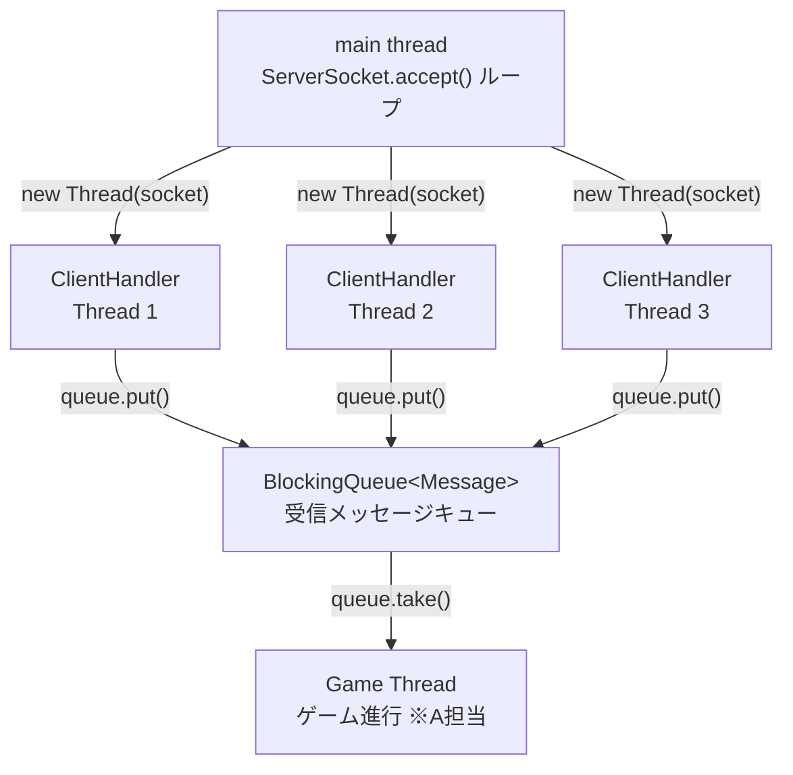
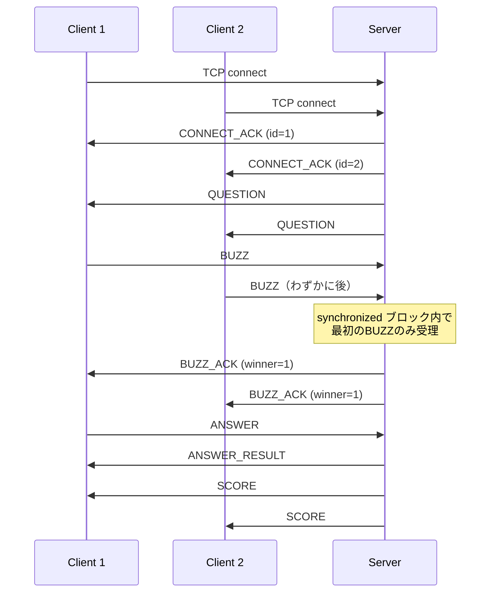

# B担当 設計メモ：通信・同期制御

担当者: B  
最終更新: 2026-05-03

---

## 1. 担当範囲

複数クライアントの同時接続管理、アプリケーション層のメッセージフレーミング設計、早押し判定の競合制御を担当する。  
A（ゲームロジック）とC（クライアントUI・テスト）が依存するメッセージ仕様とスレッドモデルを定義する。

---

## 2. 設計方針

### 2-1. フレーミング仕様

TCPはバイトストリームのため、メッセージの区切りをアプリ層で定義する必要がある。  
以下の固定ヘッダー + 可変ボディ構造を採用する。

```
| type (1 byte) | body_length (4 bytes, big-endian) | body (n bytes) |
```

#### メッセージタイプ一覧

| 定数名 | 値 | 方向 | ボディ内容 |
|---|---|---|---|
| `CONNECT` | `0x01` | C→S | プレイヤー名（UTF-8文字列） |
| `CONNECT_ACK` | `0x02` | S→C | 割り当てプレイヤーID（1byte） |
| `QUESTION` | `0x03` | S→C | 問題文（UTF-8文字列） |
| `BUZZ` | `0x04` | C→S | なし（length=0） |
| `BUZZ_ACK` | `0x05` | S→C | 勝者プレイヤーID（1byte） |
| `ANSWER` | `0x06` | C→S | 回答テキスト（UTF-8文字列） |
| `ANSWER_RESULT` | `0x07` | S→C | 正誤フラグ（1byte: 0x01=正解, 0x00=不正解） |
| `SCORE` | `0x08` | S→C | 全員のスコア（JSON文字列） |
| `DISCONNECT` | `0x09` | C→S / S→C | なし（length=0） |
| `PING` | `0x0A` | S→C | なし |
| `PONG` | `0x0B` | C→S | なし |

---

### 2-2. スレッドモデル



各クライアントに1スレッドを割り当て、受信したメッセージを `BlockingQueue` に積む。  
ゲームロジック（A担当）はキューからデキューして処理する。スレッド間の直接メソッド呼び出しは避ける。

---

### 2-3. 接続・ゲーム進行のシーケンス



---

### 2-4. 早押し同期ロジック

複数のClientHandlerスレッドが同時に `BUZZ` を受信したとき、最初の1人だけを勝者とする。

```java
// GameState（A担当クラスに持たせる想定）
private final Object buzzLock = new Object();
private boolean buzzed = false;
private int winnerId = -1;

public boolean tryBuzz(int clientId) {
    synchronized (buzzLock) {
        if (!buzzed) {
            buzzed = true;
            winnerId = clientId;
            return true;
        }
        return false;
    }
}
```

---

### 2-5. 切断ハンドリング

クライアントが突然切断すると `readLine()` / `read()` が `null` または `IOException` を返す。  
各ClientHandlerスレッドで必ずキャッチし、コネクションリストから除去してソケットをクローズする。

```java
try {
    // 受信ループ
} catch (IOException e) {
    // 切断扱い
} finally {
    clients.remove(this);
    socket.close();
}
```

---

## 3. 実装マイルストーン

| フェーズ | 実装内容 | 理解目標 |
|---|---|---|
| 1 | 現状のecho通信を読んで動かす | TCPコネクション確立・`readLine()`が改行区切りフレーミングであることを理解する |
| 2 | バイナリフレーミング実装（type+length+body） | TCPがストリームである意味・length-prefixedフレーミングの必要性 |
| 3 | マルチクライアント対応（スレッド追加） | スレッドのライフサイクル・共有オブジェクトへのアクセス競合 |
| 4 | `BlockingQueue` によるスレッド間通信 | Producer-Consumerパターン・スレッドをまたぐ安全なデータ受け渡し |
| 5 | `synchronized` で早押し判定 | race condition・`synchronized` と `volatile` の違い |
| 6 | 切断ハンドリング | `IOException`・リソースリーク・`finally` によるクローズ保証 |
| 7 | （発展）アプリ層ハートビート（PING/PONG） | TCP keepaliveとの違い・アプリ層での死活監視 |
| 8 | （発展）NIO + `Selector` に置き換え | I/O多重化・ノンブロッキングI/O・Node.jsのイベントループとの対比 |

---

## 4. 他メンバーへのインターフェース

### A（サーバー・ゲーム進行）へ

- `BlockingQueue<Message>` からメッセージをデキューしてゲームロジックを実装する
- `tryBuzz(clientId)` メソッドの仕様は2-4を参照
- クライアントへの送信は `ClientHandler.send(type, body)` 経由で行う（メソッドはBが実装）

### C（クライアント・テスト）へ

- 接続先: `localhost:8080`
- 接続直後に `CONNECT` メッセージ（プレイヤー名）を送ること
- フレーミング仕様は2-1を参照。ボディはすべてUTF-8
- 複数クライアント起動用のシェルスクリプトをCが整備予定
