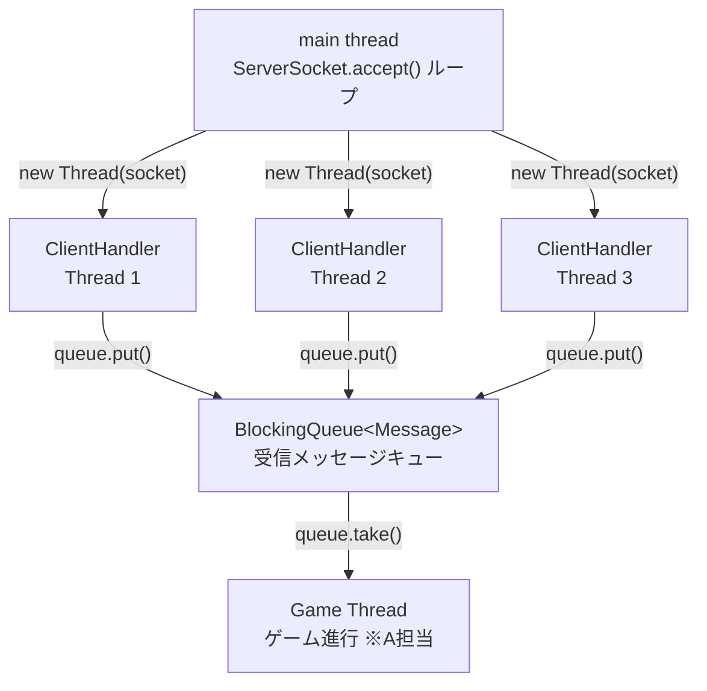
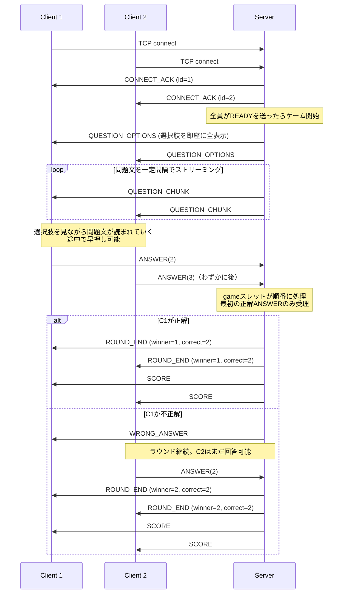

# B担当 設計メモ：通信・同期制御

担当者: B  
最終更新: 2026-05-30

---

## 1. 担当範囲

複数クライアントの同時接続管理、アプリケーション層のメッセージフレーミング設計、早押し判定の競合制御を担当する。  
A（ゲームロジック）とC（クライアントUI・テスト）が依存するメッセージ仕様とスレッドモデルを定義する。

型定数の実装: [apps/shared/codec/MessageType.java](../../apps/shared/codec/MessageType.java)

---

## 2. 設計方針

### 2-1. フレーミング仕様

TCPはバイトストリームのため、メッセージの区切りをアプリ層で定義する必要がある。  
以下の固定ヘッダー + 可変ボディ構造を採用する。

```
| type (1 byte) | body_length (4 bytes, big-endian) | body (n bytes) |
```

#### C → S メッセージ

| 定数名 | 値 | ボディ | 備考 |
|---|---|---|---|
| `CONNECT` | `0x01` | `nameLen(1)` + UTF-8（playerName、最大16バイト） | 接続通知。IDはサーバーが採番 |
| `ANSWER` | `0x02` | 1 byte（選択肢番号 0–3） | 早押し＋回答を兼ねる |
| `DISCONNECT` | `0x03` | なし | 正常切断 |
| `READY` | `0x05` | なし | ゲーム開始準備完了を通知 |

#### S → C メッセージ

| 定数名 | 値 | ボディ | 送信先 | 備考 |
|---|---|---|---|---|
| `CONNECT_ACK` | `0x11` | 1 byte（採番ID） | 本人のみ | |
| `QUESTION_OPTIONS` | `0x12` | `num_options(1)` + `[len(2) \| utf8] × n` | 全員 | 選択肢を即座に全表示 |
| `WRONG_ANSWER` | `0x13` | なし | 本人のみ | 外れ。ラウンド継続中 |
| `ROUND_END` | `0x14` | `winner_id(1)` + `correct_index(1)` + `nameLen(1)` + `winnerName(n)` | 全員 | ラウンド終了。引き分け時は `winner_id=0` / `winnerName=""` |
| `SCORE` | `0x15` | `num_players(1)` + `[player_id(1) \| score(2) \| nameLen(1) \| name(n)] × n` | 全員 | ROUND_END直後に送信 |
| `DISCONNECT_ACK` | `0x16` | なし | 本人のみ | |
| `QUESTION_CHUNK` | `0x17` | utf8_bytes（問題文の一部） | 全員 | サーバーが一定間隔でストリーム送信。早押し可能 |
| `CONNECT_NG` | `0x18` | UTF-8文字列（reason） | 本人のみ | 満員等で接続拒否。reason: `"FULL"` など |
| `GAME_END` | `0x19` | `winner_id(1)` + `nameLen(1)` + `winnerName(n)` | 全員 | 全ラウンド終了。引き分け時は `winner_id=0` / `winnerName=""` |
| `LOBBY_STATUS` | `0x1A` | `num_players(1)` + `num_ready(1)` | 全員 | READY 受信のたびにブロードキャスト |

bodyフォーマットはすべてバイナリ（JSONなし）。big-endian。

`int` を使う理由: `DataInputStream.read()` は int を返すため、byte だと符号拡張の比較バグが起きやすい。

#### QUESTIONボディのJSON例

```json
{"question": "日本の首都は？", "options": ["大阪", "京都", "東京", "名古屋"]}
```

#### ROUND_ENDボディのJSON例

```json
{"winner_id": 1, "correct_index": 2}
```

---

### 2-2. スレッドモデル



各クライアントに1スレッドを割り当て、受信したメッセージを `BlockingQueue` に積む。  
ゲームロジック（A担当）はキューからデキューして処理する。スレッド間の直接メソッド呼び出しは避ける。

---

### 2-3. 接続・ゲーム進行のシーケンス



---

### 2-4. 早押し同期ロジック

**現在の実装**: `BlockingQueue` の Producer-Consumer パターンにより、ANSWER メッセージはゲームスレッド1本がシリアルに処理する。ゲームスレッドは単一スレッドなので、`accepting` フラグはスレッドセーフな Atomic 型ではなくプレーンな `boolean` で十分。

```java
// GameManager（game スレッドのみがアクセス）
private boolean accepting = false;

private void handleAnswer(ClientSession session, int answerIndex, long receivedNs) {
    if (!accepting) {
        // 既にラウンド終了済み → LATE として記録して無視
        return;
    }
    if (answerIndex == currentCorrectIndex) {
        accepting = false;   // 以後の正解を拒否
        // ...得点加算・ROUND_END 送信...
    } else {
        // 不正解: WRONG_ANSWER を本人に送信
        // 全員不正解なら accepting = false でラウンド終了
    }
}
```

`BlockingQueue` はスレッド間の happens-before を保証するため、ClientSession スレッドが `queue.put()` した後にゲームスレッドが `queue.take()` した時点で、全ての書き込みが可視になる。`accepting` に `volatile` も Atomic も不要。

各 ClientSession スレッドが `ANSWER` を `BlockingQueue.put()` → ゲームスレッドが `take()` して順番に処理 → キューへの到着順で "早押し" を判定する。ネットワーク遅延はサーバー受信時刻で吸収済み。

---

### 2-5. 切断ハンドリング

クライアントが突然切断すると `read()` が `-1` または `IOException` を返す。  
各 ClientHandler スレッドで必ずキャッチし、コネクションリストから除去してソケットをクローズする。

```java
try {
    // 受信ループ
} catch (IOException e) {
    // 切断扱い
} finally {
    clients.remove(this);
    socket.close();
}
```

---

## 3. 実装マイルストーン

| フェーズ | 状態 | 実装内容 | 理解目標 |
|---|---|---|---|
| 1 | 完了 | 現状のecho通信を読んで動かす | TCPコネクション確立・`readLine()`が改行区切りフレーミングであることを理解する |
| 2 | 完了 | バイナリフレーミング実装（type+length+body） | TCPがストリームである意味・length-prefixedフレーミングの必要性 |
| 3 | 完了 | マルチクライアント対応（スレッド追加） | スレッドのライフサイクル・共有オブジェクトへのアクセス競合 |
| 4 | 完了 | `BlockingQueue` によるスレッド間通信 | Producer-Consumerパターン・スレッドをまたぐ安全なデータ受け渡し |
| 5 | 完了（AtomicBooleanで実装） | `synchronized` で早押し判定 | race condition・`synchronized` と `volatile` の違い |
| 6 | 完了 | 切断ハンドリング | `IOException`・リソースリーク・`finally` によるクローズ保証 |
| 7 | 未着手 | （発展）アプリ層ハートビート（PING/PONG） | TCP keepaliveとの違い・アプリ層での死活監視 |
| 8 | 未着手 | （発展）NIO + `Selector` に置き換え | I/O多重化・ノンブロッキングI/O・Node.jsのイベントループとの対比 |

---

## 4. 他メンバーへのインターフェース

### A（サーバー・ゲーム進行）へ

- `BlockingQueue<Message>` からメッセージをデキューしてゲームロジックを実装する
- `tryAnswer(clientId)` の仕様は2-4を参照。不正解時は `answered = false` に戻してラウンドを継続する
- クライアントへの送信は `ClientHandler.send(type, body)` 経由で行う（メソッドはBが実装）

### C（クライアント・テスト）へ

- 接続先: `localhost:8080`、起動コマンド: `java apps.Client`
- 接続直後に `CONNECT`（ボディなし）を送ること。プレイヤー名はサーバーが採番する
- フレーミング仕様は2-1を参照。ボディのJSONはUTF-8
- 複数クライアント起動用のシェルスクリプトをCが整備予定
